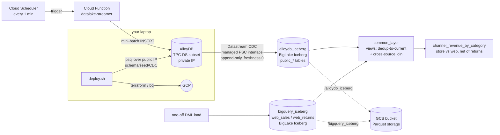

# zucchini_datalake

Terraformed GCP proof-of-concept: a streaming **AlloyDB** OLTP source replicated by
**Datastream** into **BigQuery managed Iceberg**, joined against a separately-loaded
Iceberg dataset through a common view layer. One script drives the whole lifecycle.

## Architecture



The AlloyDB source database is **`tpcds`** (Postgres user `postgres`), holding a TPC-DS
subset: the fact table `store_sales` plus the dimensions `customer`, `item`, `date_dim`,
and `store`. The Cloud Function appends rows to `store_sales`; the Sync Control Panel can
switch any of these (or new tables) on/off for replication.

Key design points:

- **Datastream → Iceberg is append-only.** The `alloydb_iceberg.public_*` tables are an
  append log (every change is a row + a `datastream_metadata` STRUCT). The
  `common_layer.*_current` views dedup to the latest row per primary key.
- **Fully managed connectivity, no proxy VM.** Datastream reaches AlloyDB through a
  managed Private Service Connect interface backed by a `network_attachment`.
- **Public IP is laptop-only.** AlloyDB has a public IP (allow-list `0.0.0.0/0` by
  default) purely so `deploy.sh` can run the schema/seed/CDC SQL via `psql`. Datastream
  itself uses the private IP. Tighten `alloydb_authorized_cidr` (or set it `""` to drop
  the public IP) for anything beyond a POC.
- **Two-phase apply.** One Terraform config, but the Datastream stream is gated behind
  `enable_stream` so the CDC publication/slot exist before the stream turns on.

## Prerequisites

- **Tools**: `terraform`, `gcloud`, `bq`, `psql`, `jq`.
  - Check missing tools using `./deploy.sh doctor`.
  - Auto-install missing packages using `./deploy.sh --install-deps`.
  - **`jq` Note**: `deploy.sh` uses `jq` to manage configuration variables. If `jq` is missing, the script will temporarily fall back to using `python3` to parse `config.json` while running checks or auto-installing `jq`.
  - **`terraform` Note**: Because `terraform` is not available in default package manager repositories, the auto-installer can fail to locate it. You can install it:
    - **Locally (Recommended)**: Download and unzip it into `~/.local/bin` (which is typically in your `$PATH`):
      ```bash
      mkdir -p ~/.local/bin
      curl -fsSL https://releases.hashicorp.com/terraform/1.9.0/terraform_1.9.0_linux_amd64.zip -o terraform.zip
      unzip -o terraform.zip -d ~/.local/bin && rm terraform.zip
      ```
    - **System-wide via APT**: Add the HashiCorp APT repository and install:
      ```bash
      sudo apt-get update && sudo apt-get install -y gnupg software-properties-common wget
      wget -O- https://apt.releases.hashicorp.com/gpg | gpg --dearmor | sudo tee /usr/share/keyrings/hashicorp-archive-keyring.gpg >/dev/null
      echo "deb [signed-by=/usr/share/keyrings/hashicorp-archive-keyring.gpg] https://apt.releases.hashicorp.com \$(lsb_release -cs) main" | sudo tee /etc/apt/sources.list.d/hashicorp.list
      sudo apt-get update && sudo apt-get install -y terraform
      ```
- **Auth**: `gcloud auth login` **and** `gcloud auth application-default login` (Terraform uses Application Default Credentials). `deploy.sh` preflight verifies both and checks the project.
- **A GCP project**: Existing, or configure `create_project: true` along with billing/org information in `config.json`.

## Configure

`config.json` is the **single source of truth** (copy from `config.example.json`):

```json
{
  "project_id": "your-project",
  "region": "us-central1",
  "zone": "us-central1-a",
  "alloydb_password": "CHANGE-ME-strong-password",
  "alloydb_authorized_cidr": "0.0.0.0/0",
  "create_project": false,
  "demo_iters": 5,
  "demo_gap": 90
}
```

Only `project_id` is required. Leave the password as the placeholder and it gets
auto-generated and written back. `deploy.sh` renders `terraform.auto.tfvars.json` from
this, so plain `terraform` works too. Any key can be overridden per-run with a flag
(`--project`, `--region`, `--password`, and so on) or `TF_VAR_*`. `demo_iters` and
`demo_gap` only matter for the optional `./deploy.sh demo` watch loop.

## Deploy

```bash
./deploy.sh                 # full run, interactive (one banner confirm)
./deploy.sh --yes           # full run, no prompts (CI / autonomous)
```

`deploy.sh all` does, in order:

| Phase | Action |
|-------|--------|
| preflight | check tools, gcloud auth, ADC, project |
| PHASE A   | `terraform apply`, all infra, Datastream stream off |
| DB INIT   | create db + schema + CDC publication/slot + seed (psql) |
| PHASE B   | `terraform apply -var=enable_stream=true`, turn the stream on |
| UI        | build + deploy the Sync Control Panel to Cloud Run |
| backfill  | wait for stream RUNNING + Iceberg tables to populate |
| load      | one-off DML into `bigquery_iceberg` |
| views     | build the `common_layer` views |
| stream on | resume the scheduler so data starts flowing (UI takes over after) |

By the time it finishes the pipeline is live and streaming, with the UI already
up to drive it. For a terminal-only watch loop instead, run `./deploy.sh demo`.

Other commands:

```bash
./deploy.sh plan            # render tfvars from config + terraform plan
./deploy.sh output          # terraform outputs
./deploy.sh doctor          # tool check
./deploy.sh --install-deps all   # auto-install missing tools, then deploy
```

Terraform's verbose output streams to `tf-apply-*.log`; the terminal shows compact
progress. The whole run is logged to `deploy-<timestamp>.log`.

## Monitor

```bash
# streaming control (the Cloud Scheduler job that drives the function)
./deploy.sh stream status          # ENABLED/PAUSED + schedule
./deploy.sh stream start           # begin streaming (every 1 min)
./deploy.sh stream once            # fire a single mini-batch now
./deploy.sh stream stop            # pause streaming

# Datastream health
gcloud datastream streams describe alloydb-to-iceberg \
  --location <region> --format='value(state)'      # expect RUNNING

# data validation (counts, current-state, the cross-source join)
bq query --use_legacy_sql=false < sql/06_bigquery_validate.sql

# quick row counts
# append_log = raw CDC change log (one row per event + re-backfills), always >= AlloyDB.
# current_state = deduped to latest row per PK, this is the number that matches AlloyDB.
bq query --use_legacy_sql=false \
  'SELECT (SELECT COUNT(*) FROM `alloydb_iceberg.public_store_sales`) AS append_log,
          (SELECT COUNT(*) FROM `common_layer.store_sales_current`)   AS current_state'

# function logs
gcloud functions logs read datalake-streamer --region <region>
```

The headline result is `common_layer.channel_revenue_by_category`: store revenue
(AlloyDB → Iceberg) vs web revenue (native Iceberg) per category, net of returns. With
streaming on, `append_log`/`current_state` climb in near-real-time (`data_freshness=0`).
Compare AlloyDB against `current_state` (deduped), not the raw `append_log`.

## Sync Control Panel (web UI)

A Cloud Run web UI for driving the pipeline without the CLI. `./deploy.sh` already
deploys it as part of a full run; the commands below are for redeploying or removing
it on its own. What it gives you:

- Per-table sync toggles. Flip each AlloyDB table's replication on or off. Turning a
  table on adds it to the publication and the Datastream stream; Datastream backfills
  and auto-creates `alloydb_iceberg.public_<table>`.
- New tables show up on their own. Any new `public` table appears in the list, so you
  toggle it on to start feeding BigQuery Iceberg without a redeploy.
- Live stats, polled every 3s: per-table AlloyDB row count, BQ Iceberg row count,
  replication lag, and the stream + scheduler state.
- Data burst. "Burst now" fires one mini-batch of `store_sales` rows; the auto-burst
  toggle starts and stops the every-minute scheduler.

```bash
./deploy.sh ui            # rebuild + redeploy to Cloud Run, prints the URL (~2-3 min first time)
./deploy.sh ui url        # print the URL again
./deploy.sh ui delete     # remove the Cloud Run service
```

The UI's runtime SA and IAM live in `terraform/ui.tf` and get created during a normal
apply. The stream's `include_objects` is `lifecycle.ignore_changes`, so live toggles
survive the next `terraform apply` (a full `./deploy.sh` re-run resets the publication
to its 5-table seed via `sql/03`).

> **Access:** the altostrat org enforces `iam.allowedPolicyMemberDomains`, so a public
> `allUsers` binding only works once you've set a project-level override allowing it
> (this project has one). When the binding succeeds the printed URL is public; if the
> org still blocks it, the service stays IAM-gated and `deploy.sh` grants the deploying
> user `run.invoker` instead. In that case open it locally with
> `gcloud run services proxy datalake-ui --region <region>` and browse `http://localhost:8080`.

## Teardown

```bash
./destroy.sh                # confirm prompt
./destroy.sh --yes          # no prompt
./destroy.sh --delete-project   # nuke the whole project (only if deploy created it)
```

`destroy.sh` pauses the scheduler, stops the stream, deletes the Datastream-created
tables in `alloydb_iceberg` (not Terraform-managed), then `terraform destroy`. GCS
buckets are `force_destroy`, so the Iceberg Parquet data is removed with them.

## Layout

```
deploy.sh / destroy.sh   lifecycle entrypoints (config.json -> tfvars -> apply -> SQL -> UI)
config.json              single source of truth (gitignored; copy from config.example.json)
terraform/               all infra (AlloyDB, VPC+PSC, Datastream, BigQuery, GCS, function, scheduler)
function/                gen2 Cloud Function, mini-batch streamer (psycopg2)
ui/                       Sync Control Panel: FastAPI + responsive page, deployed to Cloud Run
sql/                     schema, seed, CDC, Iceberg load, common_layer views, validation
scripts/                 lib.sh helpers, 05_views_demo.sh, stream.sh, ui.sh
```

## Notes / gotchas baked in

- Datastream names BLMT tables `<schema>_<table>` (e.g. `public_store_sales`).
- BLMT stream config requires `data_freshness = 0`, a `root_path` starting with `/`,
  and `connection_name` in `{project}.{location}.{name}` form.
- AlloyDB's `postgres` user can't create a replication slot (not a REPLICATION role);
  the slot is created as `datastream_user`.
- This org grants no default service-agent IAM: the compute default SA needs
  `cloudbuild.builds.builder` + `logging.logWriter` (gen2 build) and the Datastream
  service agent needs `compute.networkUser` (PSC attachment). All in `terraform/iam.tf`.
